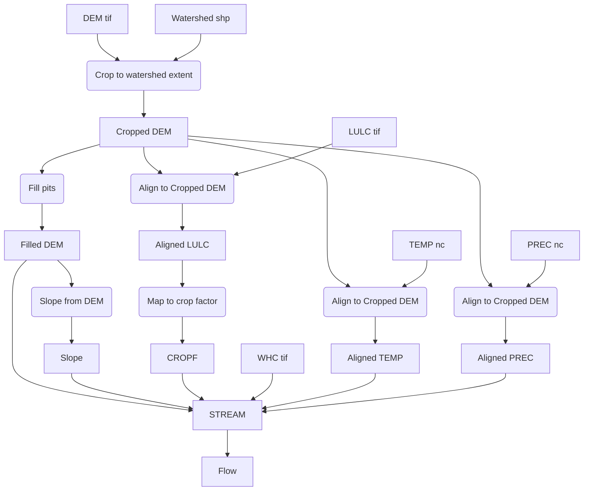

Since the dataset with highest resolution is the DEM, we will align our datasets to it.

```mermaid
graph TD
DEM[DEM tif] --> CROP(Crop to watershed extent);
WSHED[Watershed shp] --> CROP;
CROP --> DEMC[Cropped DEM];

DEMC --> ALIGNL(Align to Cropped DEM);
LULC[LULC tif] --> ALIGNL;
ALIGNL --> LULCA[Aligned LULC];

LULCA --> MAPC(Map to crop factor);
MAPC --> CROPF[CROPF];

DEMC --> ALIGNT(Align to Cropped DEM);
TEMP[TEMP nc] --> ALIGNT;
ALIGNT --> TEMPA[Aligned TEMP];

DEMC --> ALIGNP(Align to Cropped DEM);
PREC[PREC nc] --> ALIGNP;
ALIGNP --> PRECA[Aligned PREC];

DEMC --> FILL(Fill pits);
FILL --> DEMF[Filled DEM];

DEMF --> SLOPEF(Slope from DEM);
SLOPEF --> SLOPE[Slope];

DEMF --> STREAM[STREAM];
SLOPE --> STREAM;
CROPF --> STREAM;
WHC[WHC tif] --> STREAM;
TEMPA --> STREAM;
PRECA --> STREAM;
STREAM --> FLOW[Flow];
```
