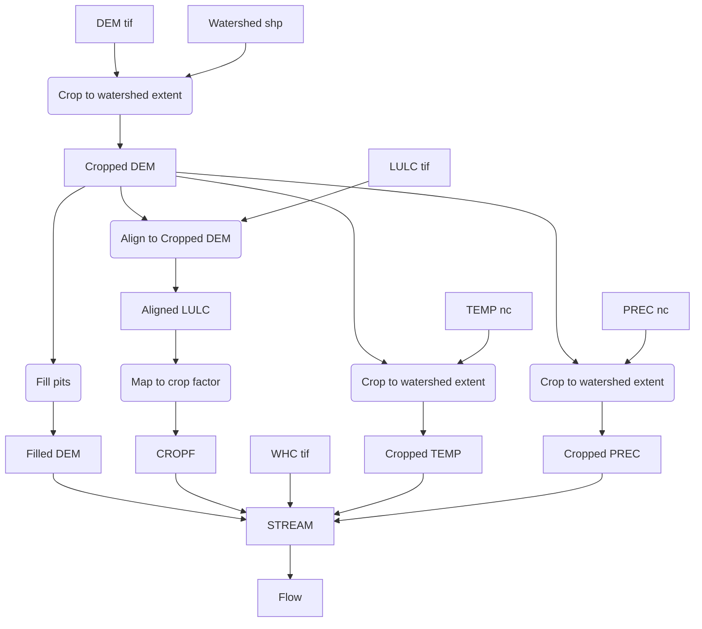

Since the dataset with highest resolution is the DEM, we will align our datasets to it.

## Notes

* Saving `.nc` files aligned to a finer resolution is verbose and space inefficient, so we will just crop them first, and align them in runtime within the `STREAM` step (thus avoiding to store the files)

