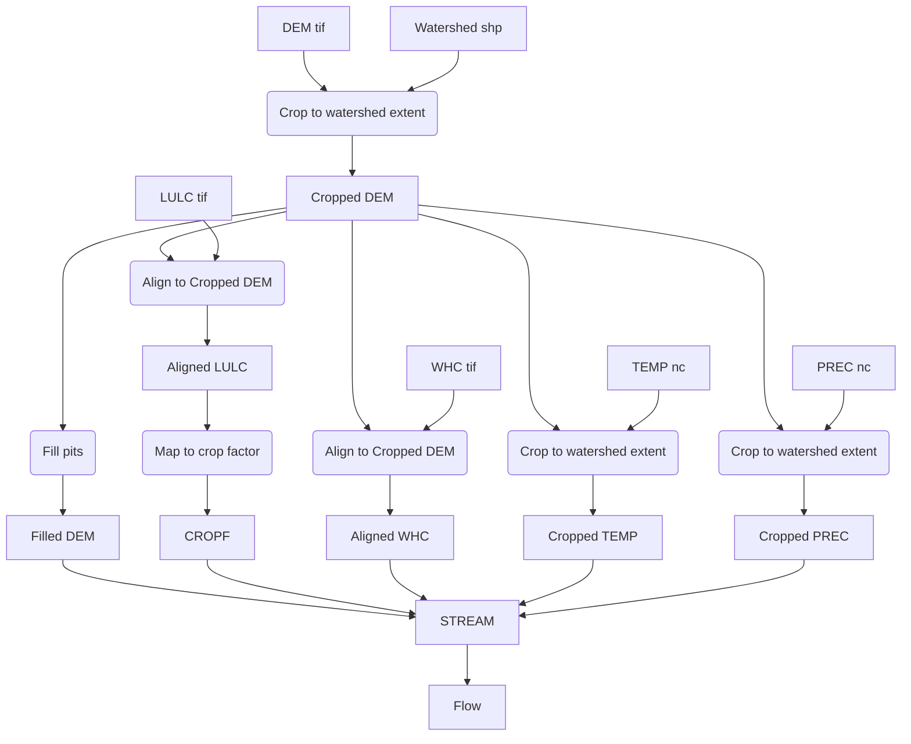

Since the dataset with highest resolution is the DEM, we will align our datasets to it.

## Notes

* In our DAG, rectangular nodes with squared edges represent data, whereas nodes with rounded edges represent computing tasks.
* By `align`, we denote a computing task consists of:
    * Cropping an input raster to match the extent of a reference raster, and
    * Aligning the input raster to match the reference of a reference raster
* Saving `.nc` files aligned to a finer resolution is verbose and space inefficient, so we will just crop them first, and align them in runtime within the `STREAM` step (thus avoiding to store the files)

